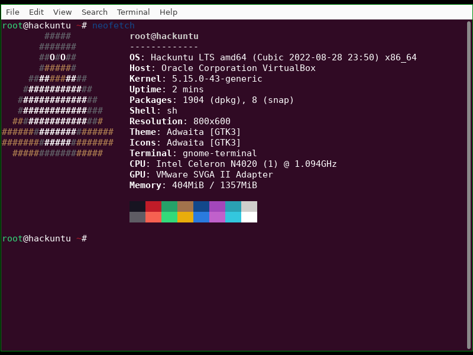
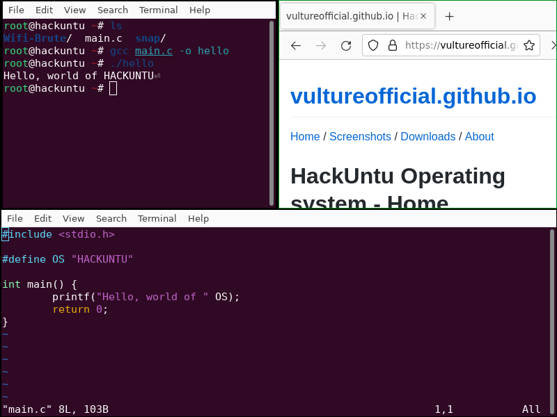
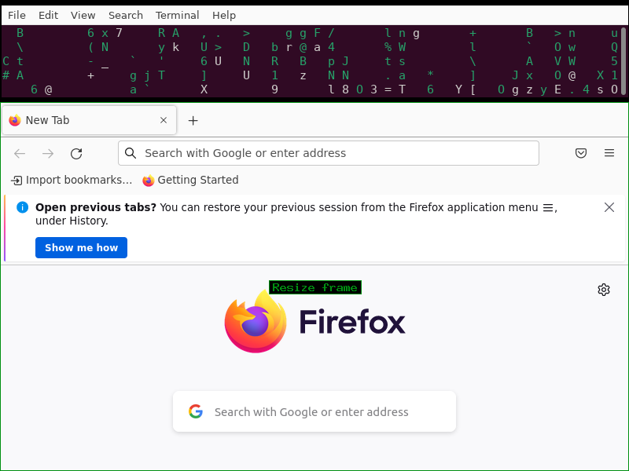
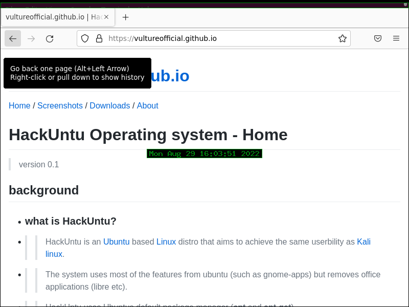

[Home](https://vultureofficial.github.io/) / [Screenshots](Screenshots.md) / [Downloads](https://vultureofficial.github.io/) / [About](https://vultureofficial.github.io/) 

# HackUntu Operating system - Screenshots
> version 0.1

> ## HackUntu running neofetch in gnome-terminal
>> 

> ## HackUntu tiling multiple windows
>> running vim, gcc and firefox
>> 

> ## HackUntu horizontal tiling of windows
>> running cmatrix and firefox
>> 

> ## HackUntu running firefox in full screen mode
>> Viewing the homepage of this website
>> 
